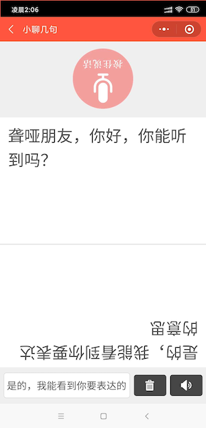
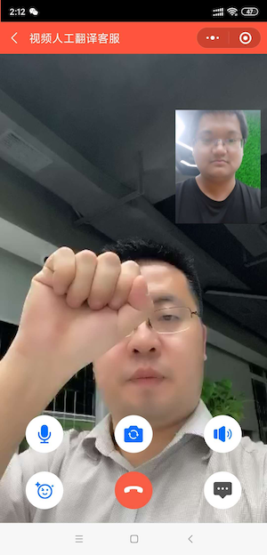

# 2020-Hackathon——译音——让聋哑人交流沟通无障碍
## 项目背景
根据第六次全国人口普查抽样调查我国残疾人占全国总人口的比例和各类残疾人占残疾人总人数的比例如下：
全国残疾人总数为8502万人。听力残疾2054万人。我国聋哑症的发病率约为2%！ 按年均人口出生率计算，连同出生后2~3岁婴幼儿，每年总的群体达5700万，听损
伤的发病人数约为17万。 我国每年有2000万新生儿出生，约有3万听力损害的新生儿出现。

## 项目痛点分析
身为一个身体不那么完美的群体，
他们在生活中经历着比我们不能想象的痛苦，
最主要的痛苦是因为这些缺陷带来的无法交流，导致没有社交，
同时如果他们去一些场所（比如银行，便民中心等需要与社会相关职能部门打交道的场所。）无法方便和相关人员方快速的交流，
没有社交让他们更加痛苦，
同时聋哑人语言是“手语”，
但是手语，普通人是看不懂的！
他们渴望与其他人的交流，
而且能非常顺利流畅的交流。
PS:以上场景如同你去外国旅游或者出差，但是对方国家的语音完全听不懂，你说的话，他们的也听不懂，你在国外如同一个聋哑人一样，但是你的情况只是展示的，而聋哑人的交流沟通障碍是伴随着他们的永生的。

为了给聋哑人士提供帮助，武汉网明无障碍科技有限公司开发了一款帮助聋哑人士正常交流同时可以提供实时手语客服视频的小程序。为聋哑人配备专门的“手语翻译”。

## 产品简介

我们知道聋哑人和普通人在交流时有两种方式，一种是把想要表达的意思用文字表达出来，然后普通人把想要交流的意思用文字写出来给聋哑人看，这样实现普通人和聋哑人的交流。l另一种是就是手语交流。手语是聋哑人的主要交流语言，但是普通人是看不懂手语的。所以
   本产品主要目标：第一是给聋哑人提供和普通人交流时需要用到的语音文字互转交流功能；第二是在聋哑人和普通人能进行基本的沟通交流时，可以更进一步，在一些特定的生活工作场景中为聋哑人提供实时视频手语客服服务，使聋哑人在处理沟通相关业务时可以更加轻松、便捷并且快速的与普通人交流，更愉悦的享受生活和工作。解决的是语音转录文字和文字转录语音慢的问题。同时手语客服相当于聋哑人随时带着一个手语翻译，可以实时的把聋哑人想要表达的意思，更加快速实时的表述给相关业务人员。因为相对用文字转录语音或者语音转录成文字沟通，聋哑人用手语更加能快速准确的表达出自己的意思。
PS：为了符合联合国针对通用设计原则，我们在产品加入中文英文转移的功能，以方便你能够你国外处于“聋哑状态”的时候可以与外国人方便的交流沟通。

## 用户定位
主要用户：存在听力障碍或听力问题，日常生活受到影响的人。
扩展用户：出国旅游，不懂英语或者当地语言用户，可以使用智能翻译和同声传译的人工客服。

## 主要功能1————让AI无障碍
### 目标：依托腾讯语音识别合成等AI技术解决聋哑人80%的交流沟通问题
语音文字互译功能是聋哑人和普通人交流的重要功能，普通人按住按钮“按住说话”即可把语音转录成文字，这样聋哑人就能明白什么意思，然后聋哑人再最下面的输入框输入想要表达的文字，普通人就能看懂聋哑人表达的意思。从而实现双方交流。

语音文字互译功能是聋哑人和普通人交流的重要功能，普通人按住按钮“按住说话”即可把语音转录成文字，这样聋哑人就能明白什么意思，然后聋哑人再最下面的输入框输入想要表达的文字，普通人就能看懂聋哑人表达的意思。从而实现双方交流。

## 主要功能2————在线手语客服
### 目标：通过手语翻译远程客服，解决聋哑人20%的交流沟通问题
 人工翻译（实时视频手语客服服务）的功能主要是提供远程视频实时手语翻译，如果聋哑人使用此功能时，相当于随身携带者一个手语翻译，这样聋哑人可以把想要表达的意思用手语给手语客服表达出来，然后手语客服把聋哑人表达的意思转述给相关人员，同时相关人员同样把想要表达的意思描述给手语客服，手语客服用手语把相关内容表达给聋哑人。比通过文字交流更加方便快捷，而且能够表达的意思更加准确，更加快速。通过这种形式真正的实现聋哑人和普通人的沟通无障碍！

客服列表

手语客服服务

## 主要功能3————让AI无障碍，通过腾讯翻译、语音识别合成集合人工 ，轻量级解决去国外交流沟通的难题
### 目标：用AI技术翻译解决80%的问题，用同声传译客服解决20%的问题。
汉英智能翻译图

## 小程序体验二维码图

## 用到产品技术使用SDK下载

访问 Github 较慢的客户可以考虑使用国内下载地址： [DOWNLOAD](https://cloud.tencent.com/document/product/647/32689) 。

## 关于我们

译音是武汉网明无障碍科技有限公司开发，
邮箱：1244581626@qq.com

